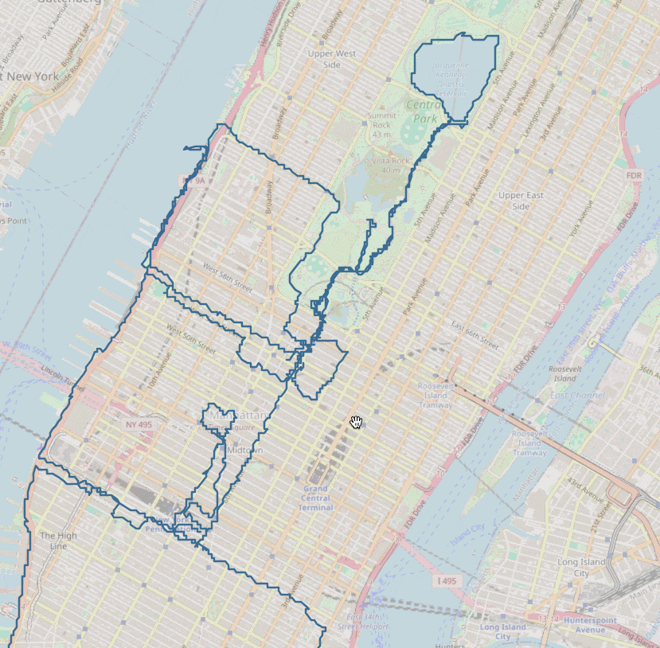
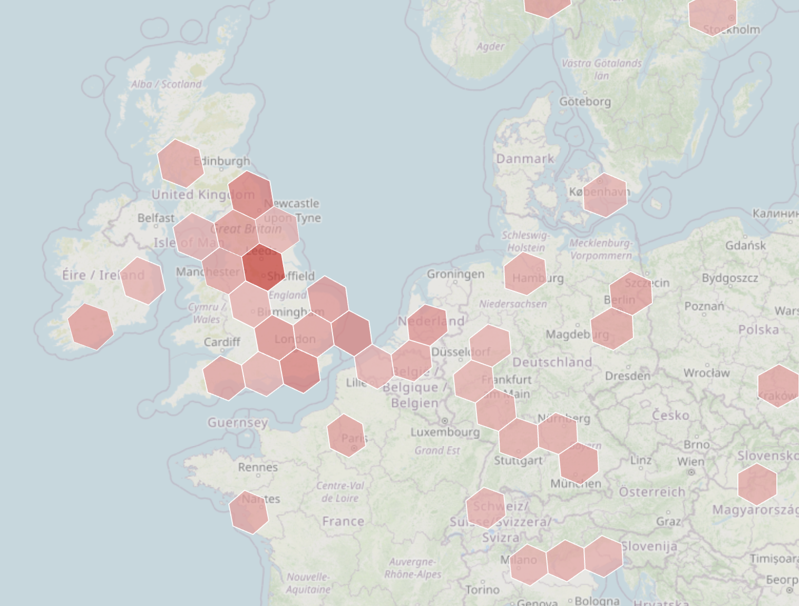
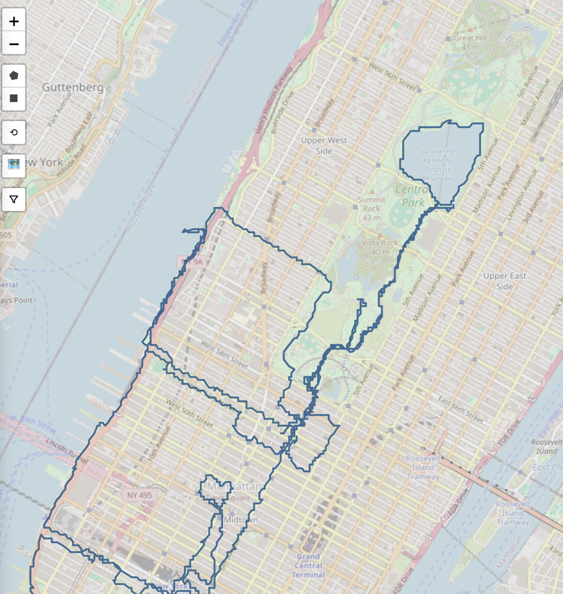
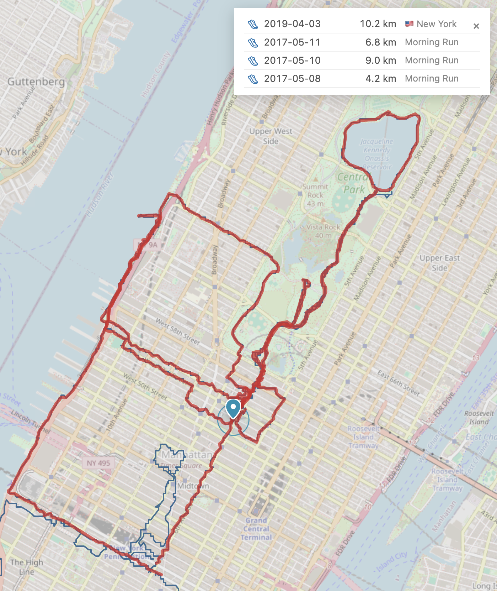
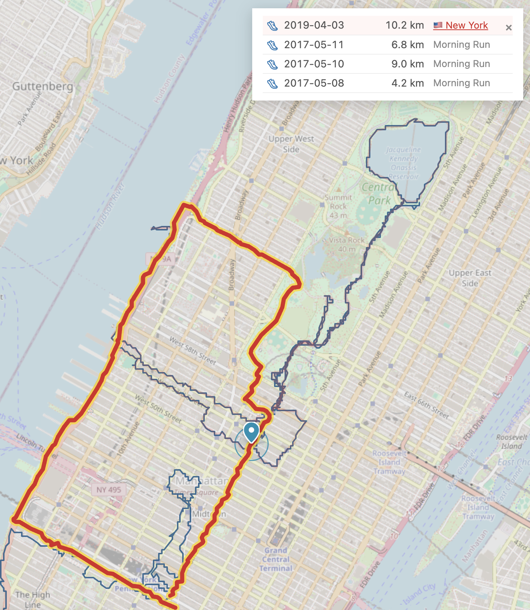
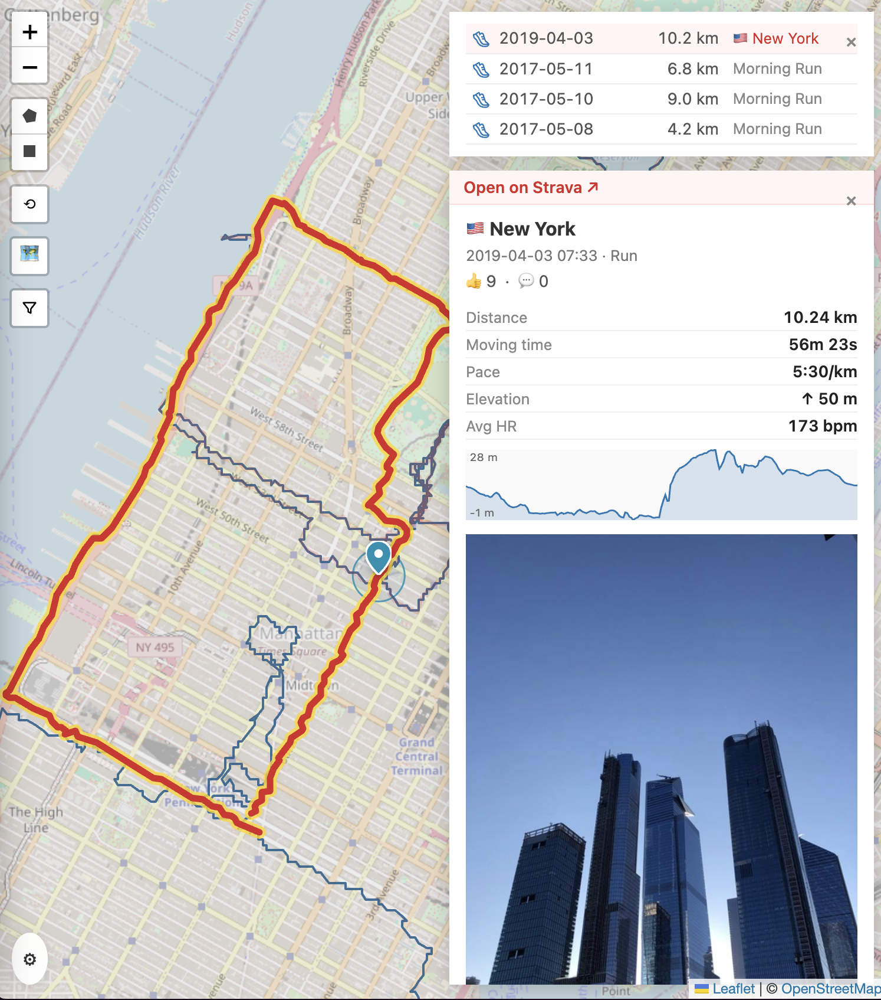
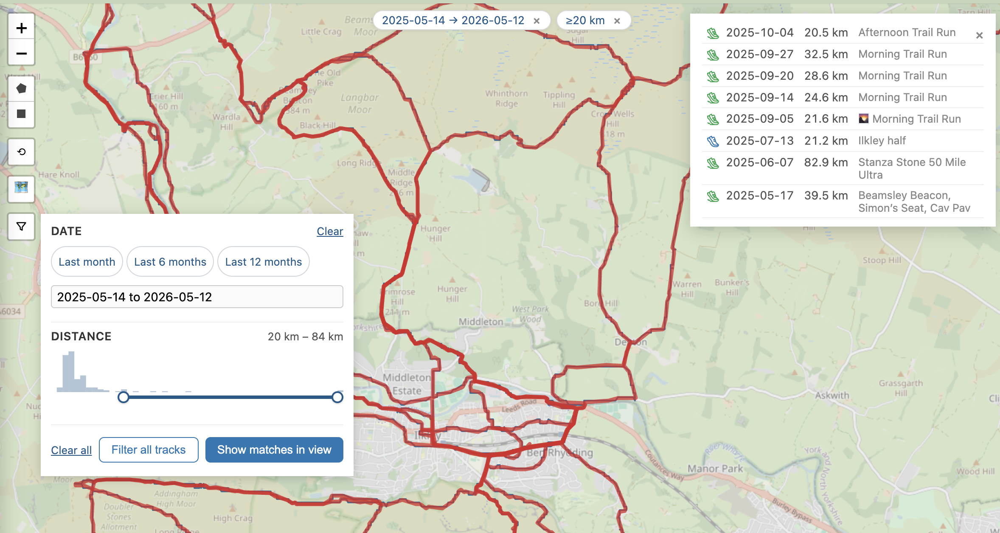

# run-map

Dreamt up on the trails whilst running, pondering that question: **"when have I run over this spot before?"**.
This is not just a regular static heatmap of your running (although it's that too).
It's focused on slicing and dicing your runs, by location, distance, and date—and giving you a dynamic list of those that match.



Pulls your runs from Strava, stores them in DuckDB, renders them on a map. Click any point or draw a polygon to find runs that passed through it.

Idea and prompting and UX by me. Code by Claude. E&EO.

## Overview

At low zoom the map shows a hex overlay. Cells are coloured by run count, so the places you've run most pop out. 



Zoom past the hex threshold and the actual tracks render.



Click a point on the map and run-map finds every track that passed by that point.



Matched tracks light up red; the list appears top-right.



Click an activity in the match list to pin it. Map flies in to frame the whole track. A card shows details of the run and photo if there is one.



As well as filtering on location, you can filter by distance and date:



## Running it

```bash
docker compose up -d --build
```

Open <http://localhost:8501>.

Data and credentials live in `./data/` (gitignored). Survives `docker compose down`.

## Loading data

Two options:

1. **Strava export ZIP** (recommended for first import) — go to <https://www.strava.com/account>, request your archive, drop the resulting ZIP into the **Import data** section of the settings.
2. **Strava API sync** — create an API app at <https://www.strava.com/settings/api> with callback domain `localhost`, paste the client ID/secret into Settings → Strava API, click Authorise, paste back the OAuth code. Then Sync now. Rate-limited (100 calls / 15 min, 1000 / day) so a full backfill takes a while; "Last 30 days" or "Last 12 months" is the usual incremental cadence.

Only `Run` and `TrailRun` activity types are imported. The bulk export CSV doesn't distinguish road vs trail — to get that split, do an API sync (or `POST /strava/fix-types` for a cheap backfill of the type column only).

## Stack

FastAPI + DuckDB + Leaflet, packaged in a single Docker container. No build step on the frontend. See [docs/SPEC.md](docs/SPEC.md) for the data model + API surface and [docs/DISCUSSION.md](docs/DISCUSSION.md) for design notes.
