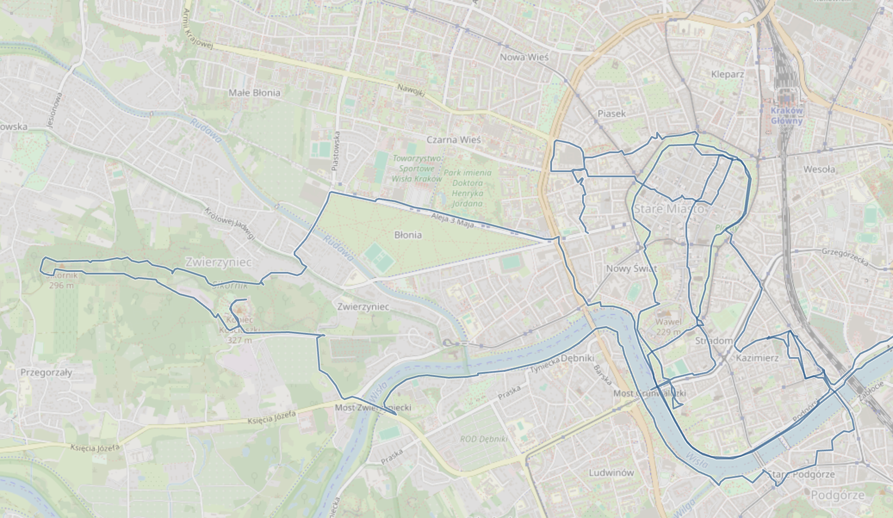
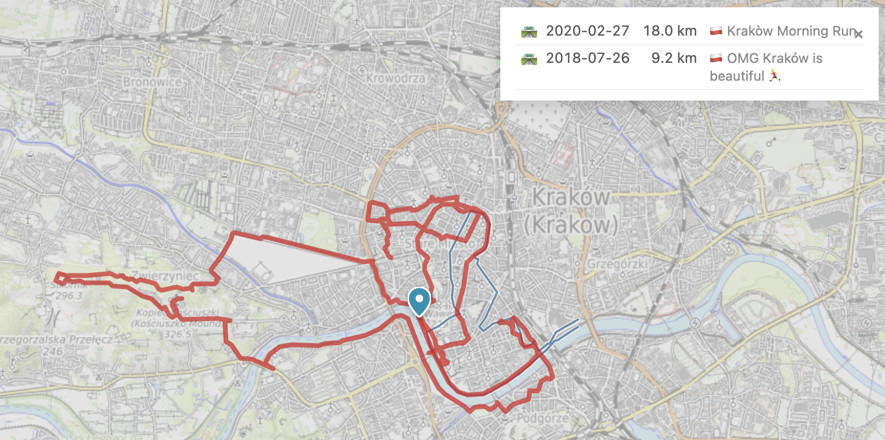
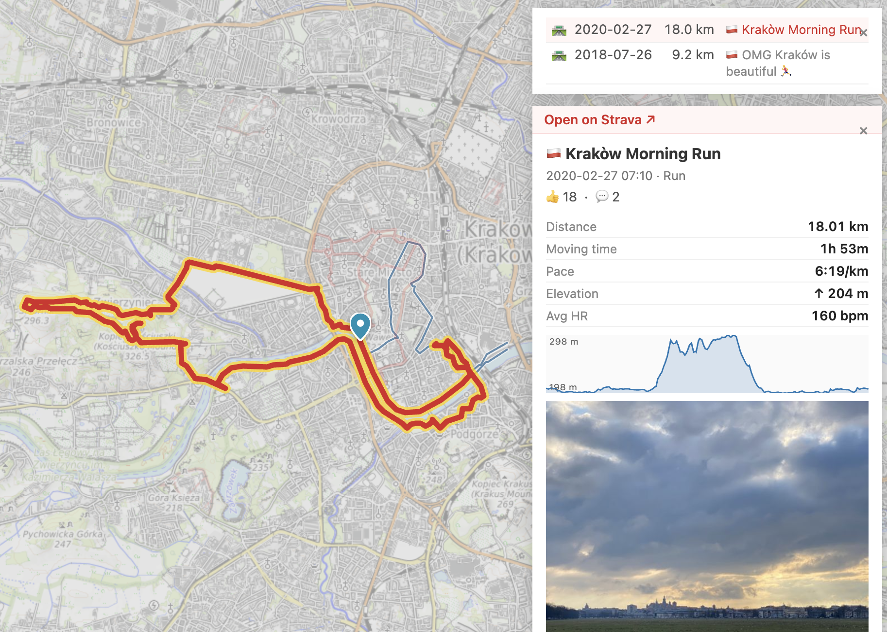

# run-map

A local web app for answering one question: **"when have I run over this spot before?"**

Pulls your runs from Strava, stores them in DuckDB, renders them on a map. Click any point or draw a polygon to find runs that passed through it.

---


At low zoom, individual tracks become invisible — so the map switches to an H3 hex overlay. Cells are coloured by run count, so the places you've run most pop out. Clicking a hex drills in to the tracks within it.



Zoom past the hex threshold and the actual tracks render — semi-transparent so popular routes naturally darken where you've trodden the same paths repeatedly.



Click anywhere on the map and run-map finds every track that passed within ~30 m (auto-scaled with zoom). Matched tracks light up red; the list appears top-right; the search point + radius are pinned in teal.



Click an activity in the match list to pin it. Map flies in to frame the whole track. A native preview card (built from Strava's API, not their iframe) shows date, distance, time, pace, elevation gain, an inline elevation profile, and any photos. Closing the preview flies the map back to the matched-set overview.

---

## Run

```bash
docker compose up -d --build
```

Open <http://localhost:8501>.

Data and credentials live in `./data/` (gitignored). Survives `docker compose down`.

## Loading data

Two options:

1. **Strava export ZIP** (recommended for first import) — go to <https://www.strava.com/account>, request your archive, drop the resulting ZIP into the **Import data** section of the settings drawer (⚙). Zero API cost.
2. **Strava API sync** — create an API app at <https://www.strava.com/settings/api> with callback domain `localhost`, paste the client ID/secret into Settings → Strava API, click Authorise, paste back the OAuth code. Then Sync now. Rate-limited (100 calls / 15 min, 1000 / day) so a full backfill takes a while; "Last 30 days" or "Last 12 months" is the usual incremental cadence.

Only `Run` and `TrailRun` activity types are imported. The bulk export CSV doesn't distinguish road vs trail — to get that split, do an API sync (or `POST /strava/fix-types` for a cheap backfill of the type column only).

## Using it

- **Click a point on the map** → matched runs appear in a panel top-right. Hover a row to highlight its track; click the run name to pin its Strava preview (bottom-right).
- **Draw a polygon / rectangle** (toolbar top-left) → all tracks intersecting it become matches.
- **Zoom out** → individual tracks give way to an H3 hex heatmap coloured by run count per cell. Click a hex to zoom into its tracks.
- **Zoom in** → a single blue layer shows every road / trail you've ever run (deduped), giving you bearings and something to click on. The precise individual tracks only appear once you've matched some.
- **Filter chips** (top-centre) → narrow the working set by year, run type, or distance. The map, heatmap and click matches all respect the filter. URL-shareable.
- **🗺 top-left** → display popover: base layer (OpenTopoMap, OSM, satellite, …), base opacity, heatmap overlay. The heatmap auto-hides while a match is active, then comes back when you clear it.
- **⟲ top-left** → view presets (All / Last 90 days / Most traversed area).
- **⚙ bottom-left** → settings drawer: click behaviour (search radius, lock-tap-to-track, zoom-to-fit), Strava API config + sync, ZIP import, library stats.
- **URL hash** carries the full view + filters + display settings, so reloading or sharing the URL restores the same state.

## Stack

FastAPI + DuckDB + Leaflet, packaged in a single Docker container. No build step on the frontend. See [docs/SPEC.md](docs/SPEC.md) for the data model + API surface and [docs/DISCUSSION.md](docs/DISCUSSION.md) for design notes.
