# run-map — UX audit

Fresh-eyes audit per `docs/superpowers/specs/2026-05-14-ux-audit-design.md`.
Severity tags: `nit` (cosmetic), `friction` (slows you down), `confusing` (misleads or wastes a click), `broken` (does the wrong thing or nothing).
Screenshots live under `docs/img/ux-audit/`. Mockups for Pass 3 live under `docs/img/ux-audit/mockups/`.

---

## Pass 1 — Desktop narrative

Auditor approached the app fresh at 1440×900 with no prior knowledge of the controls. Findings below capture every place an icon, label, or behaviour failed to match expectations on first contact. Console was clean apart from a 404 on `/favicon.ico` (cosmetic, not user-visible).

### D1. The "⟲" icon does not mean what it usually means `confusing`

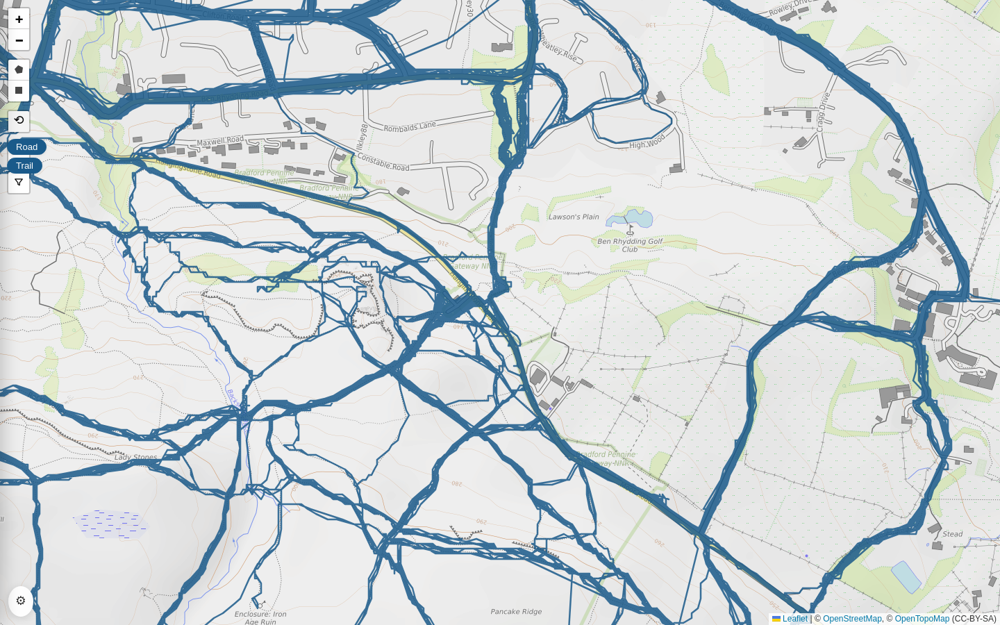

The third toolbar button is a curved-arrow glyph (1). Every other web map I have used puts a refresh/undo/reset-view icon in roughly that slot — clockwise or counter-clockwise arc means "go back to the original view". Clicking it actually flies to the most recent run (its `title` attribute confirms this once you discover hover-text doesn't render, see D2). The icon is borrowed from "reload" but the action is "fly to newest". A globe / target / play-arrow / GPS-pin icon would communicate "go to latest" far better; the curved arrow specifically suggests "undo my zoom".

**Observation:** ⟲ reads as "reset view" but actually flies to the most recent run — wrong mental model.

### D2. Toolbar icons have HTML `title` text but no visible tooltip on hover `friction`

Hovering the toolbar produces no on-screen tooltip even after a 2-second dwell (1) — this screenshot is mid-hover on the zoom-in button. The `title` attribute IS set (e.g. "Fly to most recent run", "Display", "Filter"), so the browser default tooltip eventually appears, but with the standard ~1s delay and as a tiny native OS bubble that's easy to miss. There is no custom styled tooltip. Combined with D1, this means a fresh user has to click every icon to learn what it does. The ⚙ Settings button (bottom-left) at least has `aria-label="Settings"` but no visible label either.

**Observation:** No styled tooltips — discoverability of icon-only controls relies on the OS-level `title` delay.

### D3. The 🗺 emoji on the "Display" toggle is ambiguous with the basemap `friction`

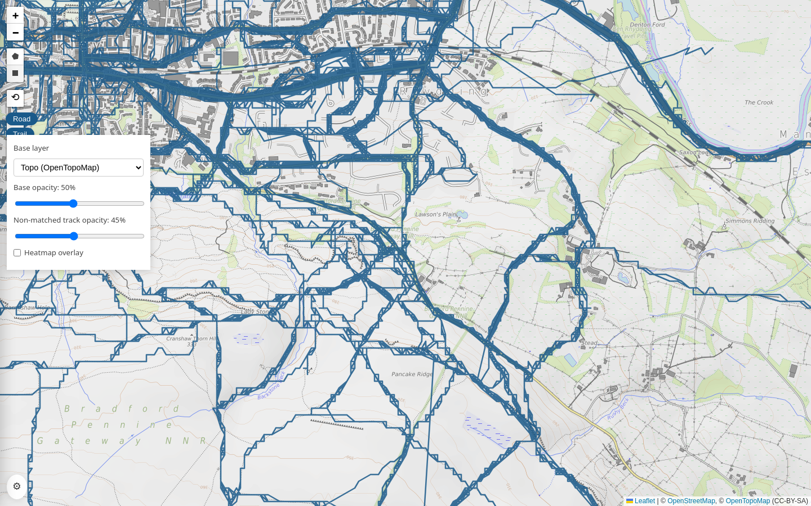

Clicking the 🗺 button opens a panel containing: Base layer dropdown (1), Base opacity (2), Non-matched track opacity (3), Heatmap overlay (4). I expected a "switch basemap" picker; the actual surface is broader (it controls opacity of *both* layers and toggles the heatmap). The label "Display" is in the title text but not on the button. A user who wants to dim track lines is unlikely to guess that's behind the 🗺 icon — it reads as "change map style", not "configure rendering".

**Observation:** 🗺 implies basemap-picker, but the panel is actually a render-controls hub (basemap + opacities + heatmap).

### D4. Two filter action buttons with overlapping labels `confusing`

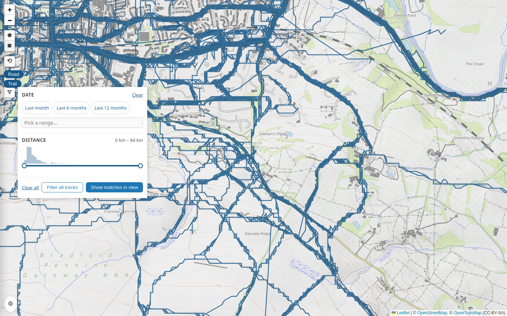

The filter pane (1) ends with **two** primary actions side-by-side: "Filter all tracks" and "Show matches in view" (2). Reading the labels alone: both contain "filter/matches", both apply to "tracks/view". The second is disabled until a match is active (no inline hint why). The right tooltip (after-the-fact) explains "Filter all tracks → Narrow the aggregate map to this filter set" and "Show matches in view → Render filtered tracks within the visible map area as red match polylines" — that's the kind of explanation that needs to be on the button or in a helper line, not buried in `title`. A fresh user has to A/B test to learn the difference.

**Observation:** "Filter all tracks" vs "Show matches in view" — labels don't differentiate; the second's disabled-state has no reason given.

### D5. Heatmap toggle silently disables itself when a match is shown `confusing`

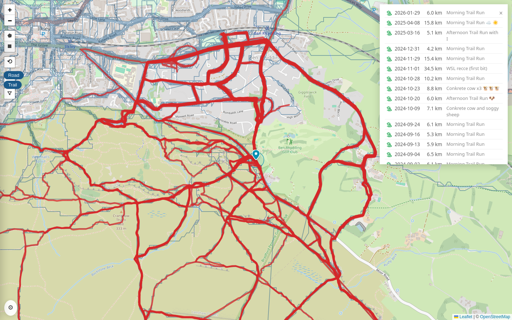

With heatmap turned on, clicking the map to fetch matches replaces the heatmap with red match polylines (correct), but the Heatmap-overlay checkbox in the Display popover remains **checked AND becomes disabled** with no visual cue inside the popover. The user toggled it on, can no longer toggle it off, and the heatmap they expected to see is gone — replaced by something they don't yet realise is mutually exclusive. No inline message like "Heatmap hidden while showing matches".

**Observation:** Heatmap and matches are mutually exclusive but the UI doesn't say so — the checkbox lies (still says "on") and goes un-clickable.

### D6. Esc clears the match panel and the pinned track but leaves the click-marker URL state `nit`

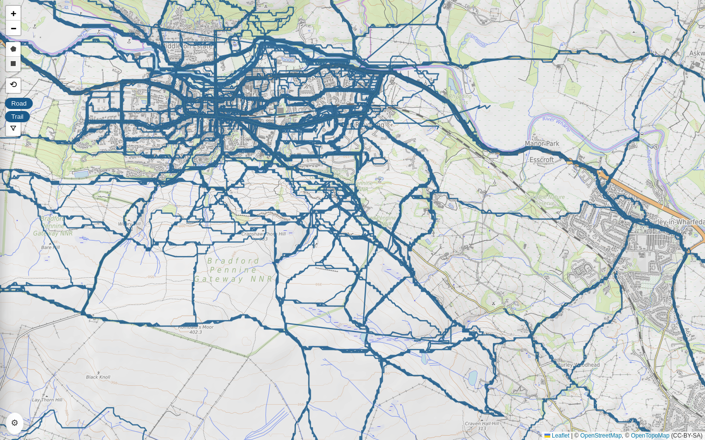

After pinning a match and pressing Escape: the right detail panel, the orange pinned polyline, and the match list all disappear (good). But the URL still contains `&cll=53.91612%2C-1.80442` from the original click. There's no visible click-marker on the map either, so nothing tells me state remains. If I share the URL or hit refresh, the matches re-open. Either the click marker should remain visible, or Esc should also strip `cll` from the URL.

**Observation:** Escape clears UI but leaves the click coordinate in the URL hash — invisible state.

### D7. Match-row table has no header or summary `friction`

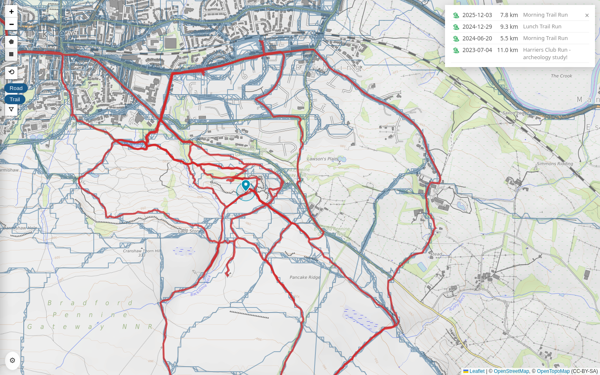

After clicking the map (1), a panel of matched tracks appears (2). It's a bare table with date / distance / title columns — no header explaining "4 matches near your click", no sort options, no indication of which column is sortable. Date and distance are linkified to Strava (good); title is a separate link that pins the track on the map (also good, once you know). But nothing tells me clicking the title pins vs clicking the date opens Strava — these are visually identical underlined links.

**Observation:** Match list has no header/count, and two link styles per row mean the same thing visually but behave differently.

### D8. Match row "Open on Strava" vs "pin" — same look, different actions `confusing`

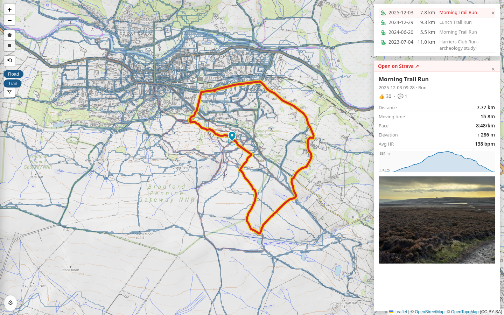

After clicking the title link, the right-hand pinned panel appears (1) with photo, stats, and an explicit "Open on Strava ↗" link at the top. So the pinned detail panel does the disambiguation properly. But the **match list rows themselves** still show date + distance as `<a href="strava.com/...">` and the title as `<a href="#">` — three identical-looking underlined links per row with two different destinations. New user has to click to discover.

**Observation:** In each match row, two of the three links go to Strava and one pins the track — they are visually identical.

### D9. Polygon-draw arming uses Leaflet.draw's default tooltip — tiny and behind the toolbar `friction`

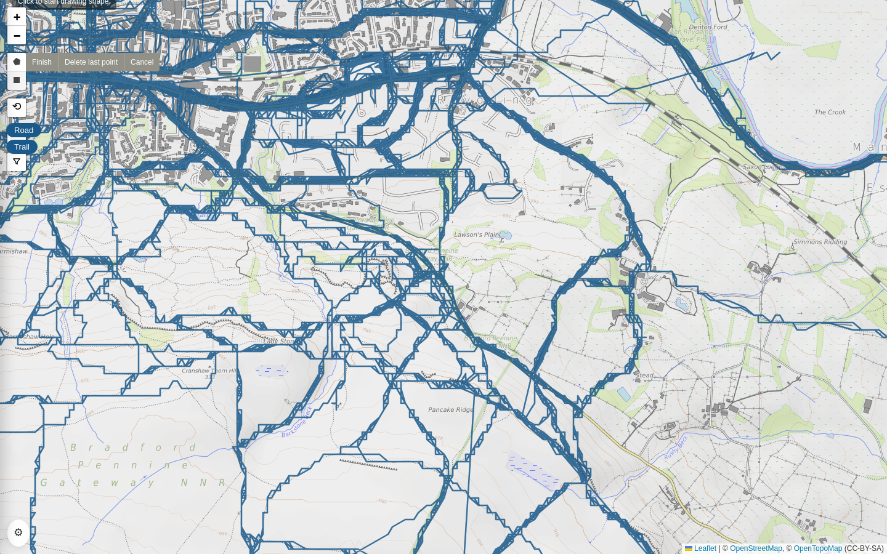

Arming the polygon tool produces a small instruction tooltip at the top-left (1) — "Click to start drawing shape" with secondary Finish / Delete last point / Cancel controls. The text is small (default Leaflet.draw styling), low contrast against the basemap, and partially overlaps the toolbar itself. There's no clear "you are now in drawing mode" affordance — the polygon-draw button doesn't get an active highlight. If a user accidentally arms it then clicks elsewhere, nothing obvious tells them they're still armed.

**Observation:** Polygon-armed state relies entirely on tiny default Leaflet.draw chrome — no body-level cursor change or button highlight indicates "drawing mode active".

### D10. Settings drawer overlaps the map and is left-aligned, while its trigger is bottom-left `nit`

The ⚙ button lives in the bottom-left corner. Clicking it slides a drawer in **from the left** (1) that covers ~25% of the map width. That is the same edge as the toolbar — the drawer covers the toolbar too. Two friction points: (a) the trigger is bottom-left but the drawer expands upward and rightward, which feels unanchored; (b) the toolbar buttons become inaccessible while the drawer is open. A right-side drawer (opposite the toolbar) or an anchored popover near the gear would be cleaner.

**Observation:** Settings drawer overlays the toolbar and isn't visually anchored to the ⚙ trigger.

### D11. Settings drawer mixes "session preferences" with "destructive admin actions" `confusing`

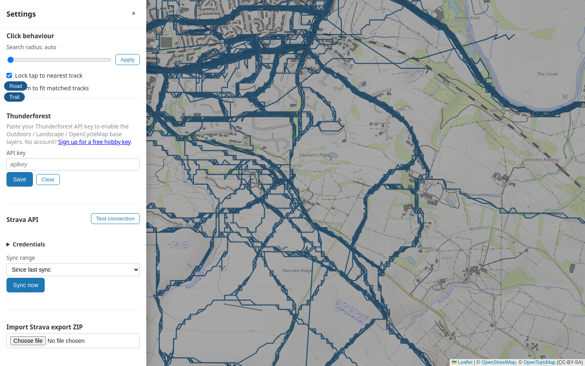

Scrolling the drawer reveals: Your library stats; Click behaviour (search radius, lock-to-nearest, zoom-to-fit) (1); Thunderforest API key entry; Strava API credentials + Sync now + Forget tokens; Import Strava export ZIP (2). That's three very different audiences mashed together: ephemeral UI prefs, third-party credentials, and a one-time bulk import. A fresh user opening "Settings" expects preferences, not an OAuth credentials form. The Strava sync controls in particular feel like they belong in a dedicated admin route, not behind the same gear as "zoom to fit matched tracks".

**Observation:** Settings drawer mixes session prefs (cheap, reversible) with API credentials and bulk import (expensive, irreversible).

### D12. "Search radius: auto" with a 0-valued slider and an Apply button `confusing`

Inside Click behaviour: a slider labelled "Search radius: auto" sits at value 0 alongside an Apply button (1). The label says "auto" but the slider is at the minimum — there's no indication of what dragging it would do, what units (meters? pixels?), what range, or why "Apply" is needed instead of live-update like every other slider in the Display popover. The two checkboxes below (Lock tap to nearest track / Zoom to fit matched tracks) update immediately, so this Apply-button slider is inconsistent with its neighbours.

**Observation:** The "Search radius" slider is the only control that needs an Apply click; units and range are not labelled.

### D13. Activity-type pills don't look like toggles `nit`

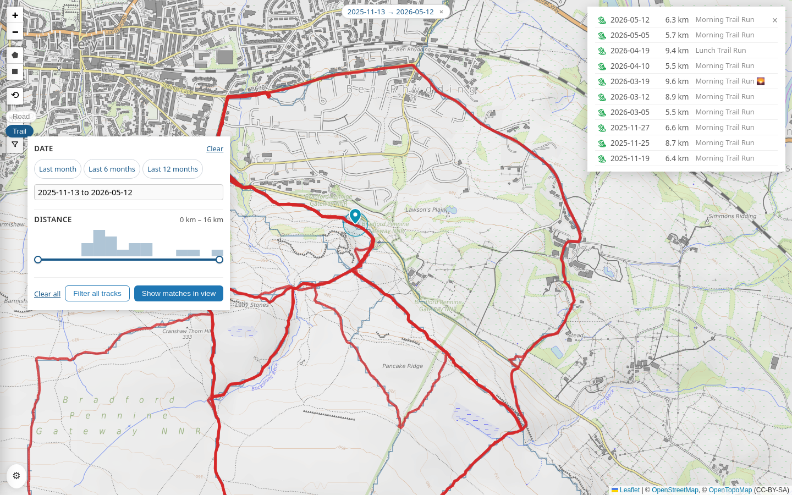

Top-left under the toolbar are two stacked pills "Road" and "Trail" — both visually identical when both active and when one is deactivated, except for a subtle colour tint. At a glance I assumed they were tabs (single-select). They are actually independent toggles (multi-select on by default). The triangle-down disclosure under them (1) — purpose unclear, possibly opens a date-band filter? — adds noise.

**Observation:** Road/Trail pills look like tabs but act like checkboxes; the disclosure caret below has no obvious function.

### D14. Chip × is a plain ``, not a button `nit`

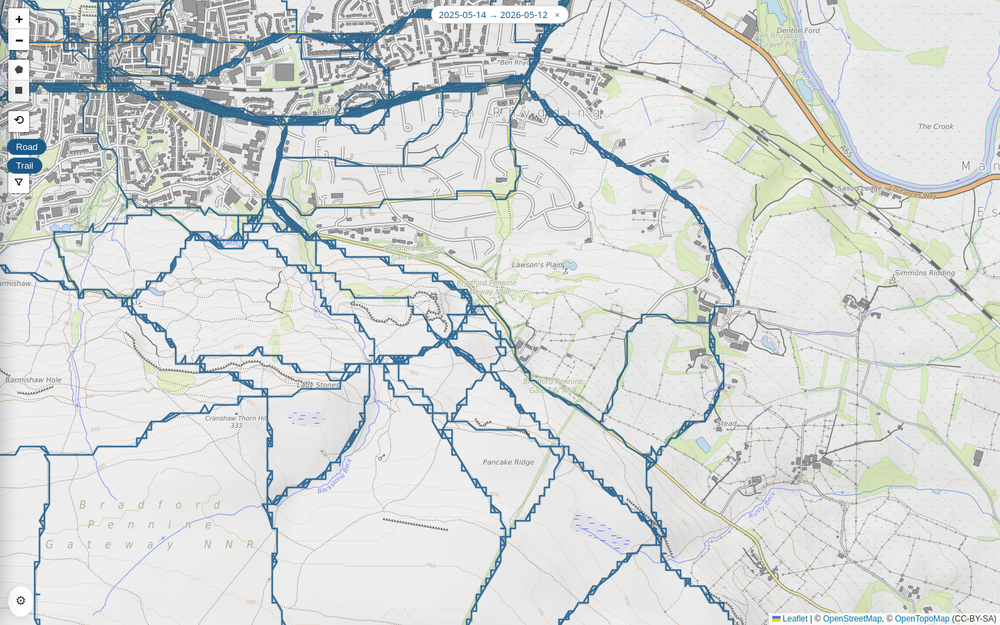

The filter chip at top-centre (1) shows "2025-05-14 → 2026-05-12 ×". Removing the filter requires clicking the small × glyph. Inspecting its markup: it's `×` — not a `<button>`, no focusable tab-stop, no accessible role, and a small click target (~12px) sitting flush against the date text. Clicking the chip body does nothing — only the × works. The "Remove" tooltip only shows via OS title hover.

**Observation:** Chip × is a non-focusable span with a tight click target; only it (not the chip body) clears the filter.

### D15. Reload restores filter and pin, but not the pinned detail panel `friction`

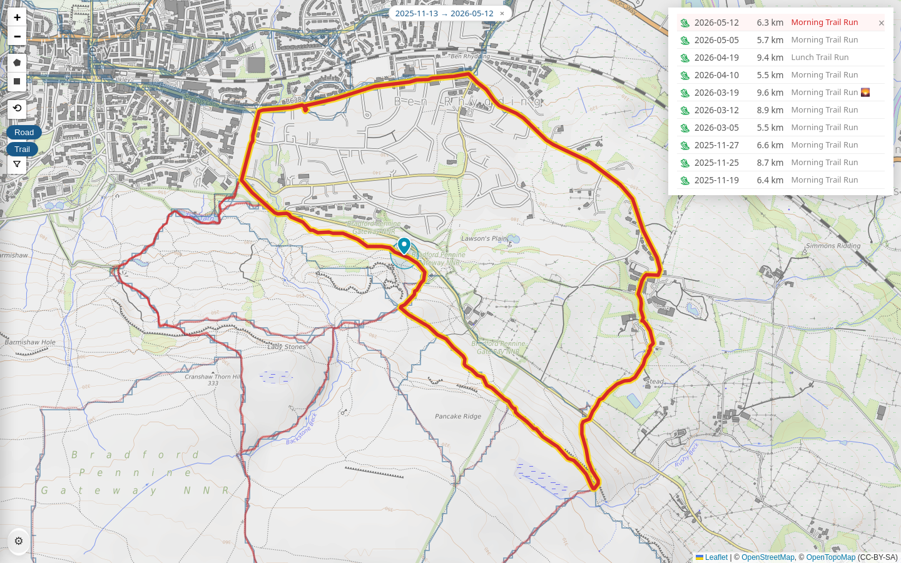

Loading a deep URL with `mid=...` re-renders the orange pinned polyline (1) and the match list (2), but the right-hand pinned detail panel (the one with photo, stats, Strava link from D8) is NOT restored. A user who shares a URL gets a partial state — the match is shown on the map but the detail card a click would have revealed is missing. Either auto-open the detail panel from `mid`, or remove `mid` from the URL when the detail panel closes — currently the state is half-persisted.

**Observation:** Deep-link with `mid` restores the highlighted match but not the detail card, so reload silently loses information.

### D16. ⚙ Settings is the only bottom-left control; everything else is top-left `nit`

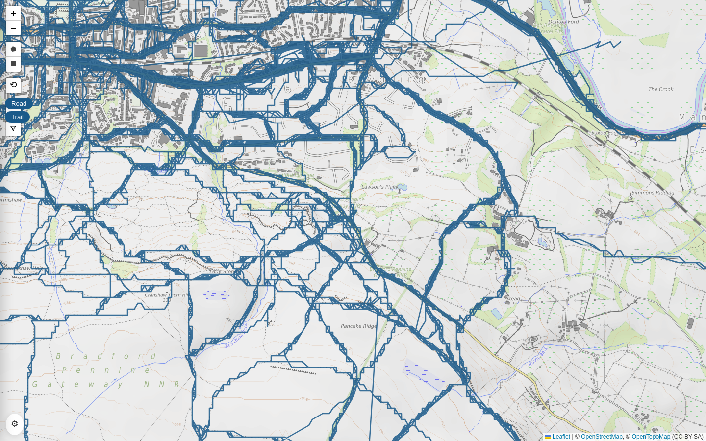

On boot the toolbar stack is at top-left, the activity-type pills are below it, and the lone ⚙ button is in the bottom-left corner — far away. Visually it doesn't feel like part of the same control system. Combined with D10 (the drawer slides out next to the toolbar, not the gear), there's no clear "controls live here" region.

**Observation:** Spatial grouping is inconsistent — ⚙ is detached from the rest of the chrome and from its own drawer.

### D17. URL hash uses cryptic short keys `nit`

The URL after applying state looks like `#z=15&ll=53.91637%2C-1.79882&fds=2025-11-13&fde=2026-05-12&ftype=TrailRun&cll=53.91744%2C-1.80200&mid=18472657487&hm=1&base=OpenStreetMap&op=80`. Keys: `z, ll, fds, fde, ftype, cll, mid, hm, base, op`. A user copy-pasting / hand-editing the URL has no way to know that `fds`/`fde` are filter date start/end, `cll` is click lat-lng (vs `ll` map centre), `mid` is match id, `hm` is heatmap, `op` is opacity. Not a fresh-user blocker but a friction for anyone debugging or sharing.

**Observation:** Hash params are unguessable abbreviations.

### D18. Hex cells at low zoom are silent — clicking does nothing visible `confusing`

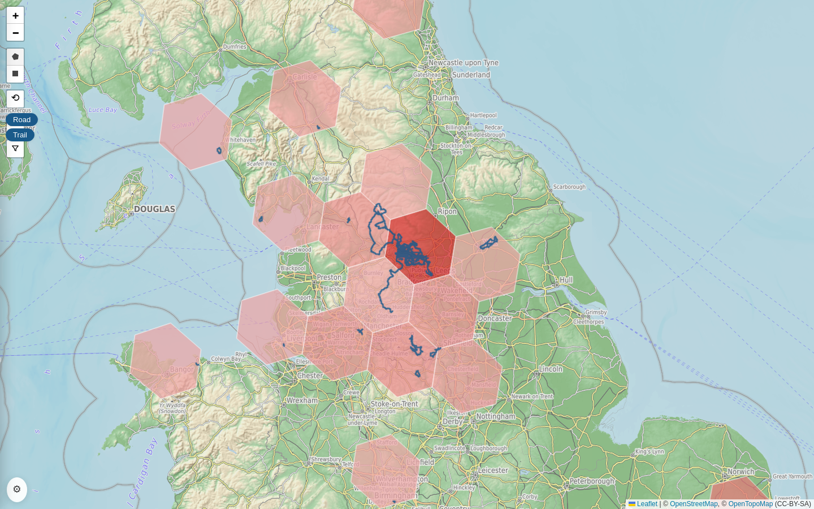

Zooming out to z≈8 swaps the per-track lines for an aggregate hex-cell layer (semi-transparent blue/teal polygons). There is no legend, no count, no key telling a user what the hex colour intensity means (run count? distance?), and **clicking a cell produces no response** — no tooltip, no popover, no count, no flyout (`desktop-sweep-hex-click.png` is indistinguishable from the no-click state). Compared with z>11 where clicking the map opens a match list, the low-zoom interaction model is silently different. A user who taps a cell expecting "show me runs in this area" gets nothing.

**Observation:** Hex aggregate cells at z<11 have no legend and are not interactive — clicking is a no-op.

### D19. Turning both activity pills off hides every track silently `confusing`

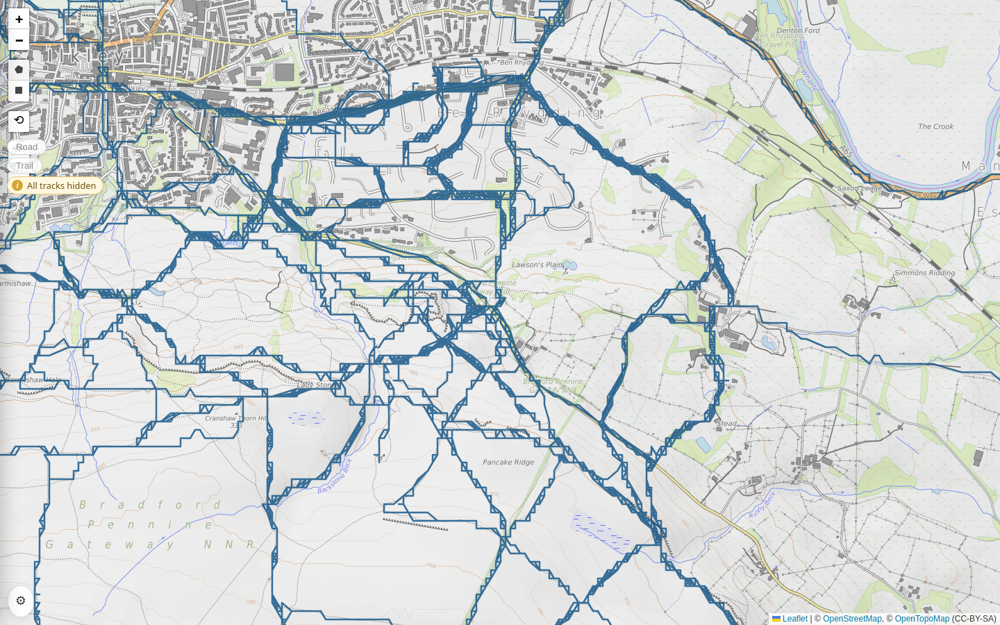

Deactivating both Road and Trail pills removes every aggregate track from the map (correct), but there is no inline notice — no banner, no "(i) All tracks hidden — re-enable Road or Trail" message, no greyed-out empty-state overlay. The basemap is the only thing left. A user who toggled both off (e.g. to compare just heatmap) sees an empty map and may assume the app broke. The spec hinted at an "All tracks hidden" notice but it isn't rendered.

**Observation:** Both-pills-off state silently empties the map — no empty-state messaging.

### D20. No "run-map" brand pill is rendered `nit`

The Pass 2 checklist expected a `run-map` brand label at bottom-left, but inspecting the DOM shows no element with that text and no `.brand` / `.logo` node. The bottom-left contains only the ⚙ Settings button (D10/D16). Either the brand was removed at some point or it never existed in this build — there is currently no app-level identification on screen, which is a minor wayfinding gap when the page is one of many tabs.

**Observation:** No visible app brand/name anywhere in the UI chrome.

---

## Desktop coverage-checklist sweep

- Zoom + control — covered by D2 (`desktop-hover-zoom-in.png`).
- Zoom − control — covered implicitly by Pass 1 (`desktop-click-zoom-in.png`); same control family as +.
- Polygon-draw control — covered by D9 (`desktop-polygon-armed.png`, plus `desktop-polygon-drawn.png` / `desktop-polygon-closed.png`).
- ⟲ reset button — covered by D1 (`desktop-hover-reset.png`, `desktop-click-reset.png`).
- 🗺 display popover (base layer / base opacity / non-matched opacity / heatmap toggle) — covered by D3 + D5 (`desktop-display-open.png`, `desktop-display-opacity.png`, `desktop-display-baseswitch.png`, `desktop-heatmap-on.png`).
- Funnel / filter pane (date, distance, action row) — covered by D4 (`desktop-filter-open.png`, `desktop-filter-applied.png`).
- ⚙ settings drawer — covered by D10–D12 (`desktop-settings-open.png`, `desktop-settings-strava.png`, `desktop-settings-bottom.png`).
- ❌ Brand pill (`run-map` label, bottom-left) — not present in the DOM. Logged as **D20** (discoverability/brand gap).
- Road / Trail pills (both on, one off) — covered by D13 (`desktop-trail-only.png`).
- ⚠️ Road / Trail pills both off + "(i) All tracks hidden" notice — narrative did not test this; captured in `desktop-sweep-pills-both-off.png`. The "All tracks hidden" notice does **not** render — logged as **D19**.
- Filter chip bar (date chip, distance chip, × dismiss) — covered by D14 (`desktop-filter-applied.png`, `desktop-filter-chip-removed.png`).
- Matches panel (capped at 50 vh, × dismiss) — covered by D7 (`desktop-map-click.png`); a `#matches-close` × button confirmed in DOM at top-right of the panel.
- Strava preview panel (× dismiss) — covered by D8 (`desktop-match-pinned.png`); a `#preview-close` × button confirmed in DOM.
- Click → match (with click marker + radius circle) — covered by D7; click marker / radius circle visible in `desktop-map-click.png` and `desktop-sweep-click-marker.png`.
- Polygon close × button at NE corner of the polygon — covered by `desktop-polygon-closed.png` referenced from D9.
- ⚠️ Hex cells at low zoom (z<11) — narrative never zoomed out; captured in `desktop-sweep-hex-cells.png` and `desktop-sweep-hex-click.png`. Clicking a hex is a silent no-op — logged as **D18**.
- Heatmap auto-hide while match is active (toggle greyed) — covered by D5 (`desktop-heatmap-vs-match.png`).
- Esc clears selection — covered by D6 (`desktop-after-esc.png`).
- URL reload restores state — covered by D15 (`desktop-after-reload.png`).
- Browser back across navigation — covered by Pass 1 setup (`desktop-after-back.png`).

**Summary:** 3 items needed new capture (pills-both-off, hex cells at low zoom, hex click). 3 new findings added (D18 hex-click silent / no legend; D19 both-pills-off has no notice; D20 no brand pill). 1 item (brand pill) is confirmed unreachable — it doesn't exist in this build.

---

## Pass 1 — Mobile narrative

Auditor approached the app fresh at 390×844 (iPhone 12/13/14 portrait), no prior knowledge of the mobile layout. The console at boot was clean — same two `Password field is not contained in a form` verbose notes seen on desktop, no errors or warnings. Findings below focus on places where mobile diverges from desktop or where the smaller viewport amplifies a known issue.

### M1. Activity-type pills land on top of the toolbar buttons `broken`

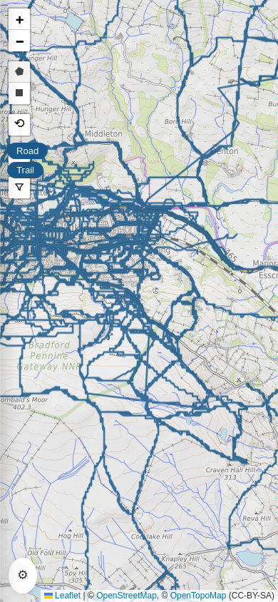

This is the single most visible mobile-only defect at boot. The vertical toolbar stack lives at x=10–44 with five buttons running from y=10 to y=278 (Zoom +, Zoom −, Polygon, Rectangle, ⟲ Reset, 🗺 Display, Filter). The Road/Trail activity pills are positioned absolutely at x=10, y=200 and y=227 — **directly on top of the 🗺 Display button (y=204–234) and overlapping the Filter button (y=248–278)**. The pills sit in the same x range (10–67) as the toolbar (10–44), so the pills physically cover two icon controls. On the boot screenshot (1) you can see the "Road" pill sitting where the Display 🗺 icon should be — the icon is not visible at all. The 56 px gutter that the spec promises between the left toolbar and the right-side rail does not exist; instead there's a 0 px gutter where left-stacked chrome collides with itself. Tapping either Road or the 🗺 button at that location is essentially a coin flip.

**Observation:** Road/Trail pills are absolutely positioned on top of two toolbar buttons — the Display and Filter icons are unreachable until a pill is hidden or moved.

### M2. (Same as D1, D2) ⟲ icon + missing tooltips — worse on mobile

On desktop (D1, D2) the ⟲ button reads as "reset view" rather than "fly to most recent" and there are no styled tooltips. On mobile the issue is amplified: there is no hover state at all — a tap commits the action. Combined with M1 (pills occluding Display and Filter), the only way to learn what any toolbar button does is to tap it and watch the map react. The OS-level `title` tooltip that rescues D2 on desktop simply doesn't exist on touch.

**Observation:** Icon-only toolbar with no tooltip is bad on desktop, worse on touch where there is no hover-to-disambiguate fallback.

### M3. Filter popover takes the full viewport width `friction`

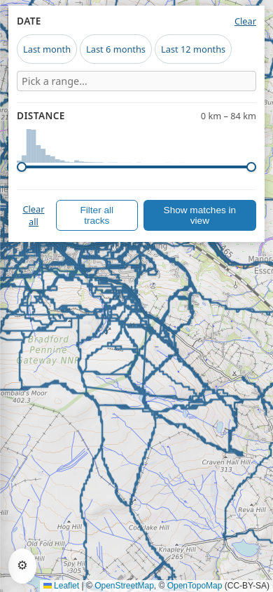

The filter popover renders at x=12, y=8, width=366, height=337 — covering essentially the entire upper half of the screen (1). It is anchored to the Filter toolbar button but the button itself sits underneath the popover. There is no × close on the popover; tapping outside or hitting the Filter button again toggles it. The popover content (date presets, distance, two action buttons) does fit, but the "Filter all tracks" / "Show matches in view" pair (D4) inherits the same labels-don't-discriminate problem and now those two buttons are side-by-side at the bottom of a panel that occupies most of the screen, raising the cost of an exploratory tap.

**Observation:** Filter popover behaves as a quasi-full-screen sheet without sheet affordances (no drag handle, no header, no × close).

### M4. Display popover sits on top of the Filter button it didn't open from `confusing`

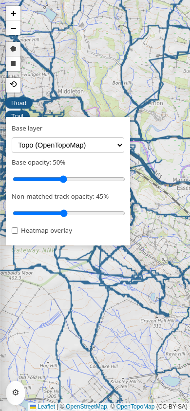

Opening the 🗺 Display popover anchors it at x=12, y=240, width=255, height=264 — so it extends down to y=504 (well into the map). The Filter toolbar button at y=248–278 ends up underneath the popover. A user who opens Display and then wants to also open Filter has to dismiss Display first. There is again no × on the popover.

**Observation:** Mobile popovers don't dodge the toolbar — they cover sibling buttons.

### M5. Settings drawer covers ~92% of the viewport with no visible map underneath `friction`

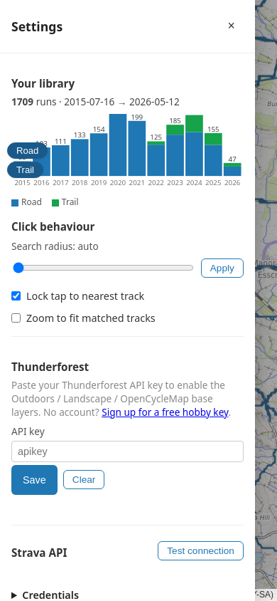

On desktop (D10, D11) the drawer is a left-edge slab that covers ~25 % of the map and feels detached from its trigger. On mobile the same drawer at 359 of 390 px occupies 92 % of the viewport — basically a full-screen sheet, but again with no drag handle, no "Done" affordance, only a small × at top-right. Inside, the Click-behaviour section (D12), Thunderforest credentials, Strava OAuth, and Strava import (D11) are all stacked in a single long scroll. On a phone this means a user opening Settings to toggle "Zoom to fit matched tracks" is two finger-scrolls away from a destructive "Forget tokens" button. The Search-radius slider (D12) renders correctly but the Apply button (60 × 27 px) is below the minimum recommended touch target.

**Observation:** Settings is a full-screen sheet without sheet conventions; safe and destructive controls share the same scroll, which is a bigger risk on touch where mis-taps are common.

### M6. Matches panel hard-wraps against the toolbar with no breathing room

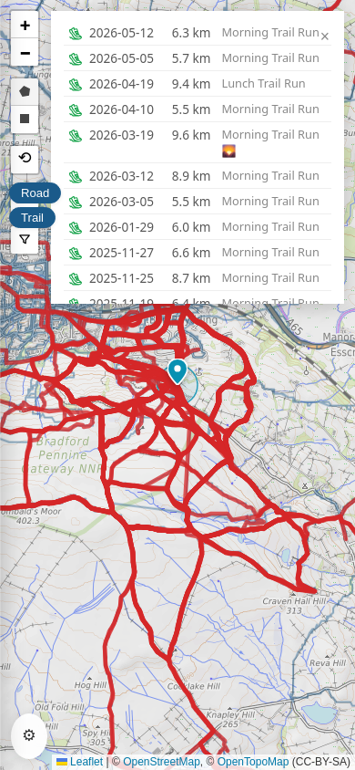
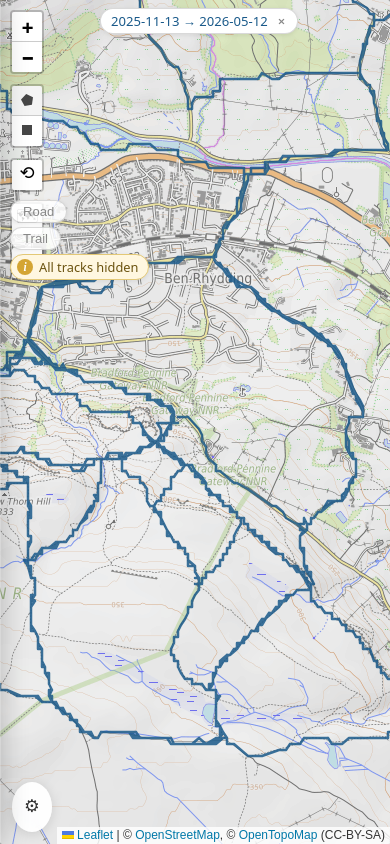

After a map tap, the matches panel renders at x=56 (right against the toolbar at x=10–44, with a 12 px gap), y=12, width=322, height=320. That's 82 % of viewport width — fine — but the panel pushes flush against the toolbar with no margin. More importantly the matches panel header gives no count and no sort affordance (same as D7) and the table column widths squash on the smaller viewport: the title column is only ~107 px wide so most run names wrap to two or three lines (e.g. "Punk Panther Wharfedale Skyline", "Splashing around the moor in my grippy s…" gets truncated mid-word). Identical-looking link styles (D8) for two-different-destinations are still present and even more confusing when each row is now 3 lines tall.

**Observation:** Matches panel docks against the toolbar with no gutter; small viewport amplifies the D7/D8 link-ambiguity issue.

### M7. Strava preview carousel — dots are 6×6 px and hard to tap or even see

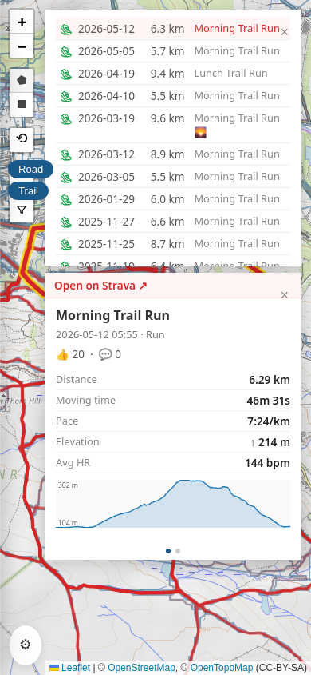
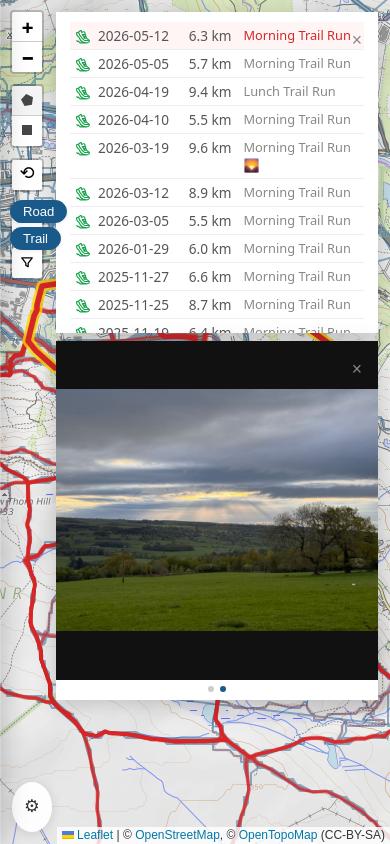

Tapping a match title opens the preview below the matches panel. It is a horizontally scrolling carousel of two pages: page 1 (details, stats, "Open on Strava ↗" link) and page 2 (photo). Scroll-snap works correctly and the photo fits within the viewport on page 2. **But** the dot indicators at the bottom of the carousel are 6 × 6 px spans (1) with 6 px gap, at y=685 — they read as decoration rather than a control. They are also non-interactive: tapping a dot does not jump pages, the user must horizontal-swipe. On a 390 px viewport with the matches panel taking the top half and the carousel taking the bottom half, the user gets *two* nested vertical scroll areas (matches list, page 1 details) plus a horizontal scroll (preview pages) all interleaved — a recipe for accidental scroll-direction collisions.

**Observation:** Carousel dots are 6 px static decorations, not tap targets; nested scroll regions (vertical-in-vertical-with-horizontal) on a phone is fragile.

### M8. Preview pushes the matches panel into a tiny scroll port

With the matches panel at y=12 height=320 and the preview at y=340 height=359, plus the top URL bar, basically the entire viewport is consumed by chrome. The map is no longer visible beneath the chrome — the user has lost their place. There is no resize handle to give more of the screen to either panel, and the preview is not modal so it doesn't *replace* the matches list, it stacks below it.

**Observation:** When a match is pinned, the entire viewport is panels; the map (the actual subject of the app) is hidden.

### M9. ⚙ Settings button is bottom-left, in the thumb hot-zone — but everything else is bottom-far `nit`

On a 390 × 844 phone the ⚙ button (12, 786, 40 × 42) is well placed for thumb-reach — bottom-left is one of the easiest spots to hit on a one-handed phone hold. **However**, all the controls the user actually needs (toolbar buttons, pills, filter chip) live at the *top* of the screen, in the hardest-to-reach zone. The frequency-vs-reachability is inverted: the rarely-used Settings gear is reachable, the constantly-used Zoom/Display/Filter buttons are not. The matches panel × button (340, 20, 34 × 42) and preview × (340, 349, 34 × 42) are top-right — the worst spot for a right-handed thumb.

**Observation:** Critical controls live in the top-left and top-right corners — both awkward thumb zones — while the bottom of the screen is largely empty.

### M10. Filter chip × is even smaller than on desktop and now also collides with toolbar `friction`

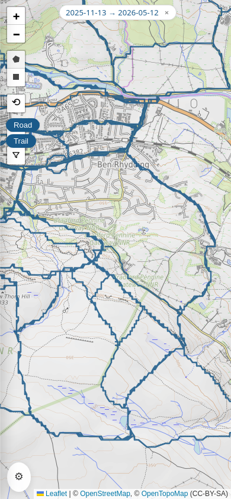

The filter chip "2025-11-13 → 2026-05-12 ×" sits at x=100, y=8, height=26 (1). On desktop (D14) the × was already a small ``; on mobile the chip's height is only 26 px and the × glyph is roughly 12 px wide pressed flush against the date text. To clear the filter the user must hit a sub-15 px target, well below Apple's 44 × 44 minimum and Google's 48 × 48. Worse, the chip sits at y=8 — the exact strip the matches panel × button also occupies (y=20, x=340) when matches are open — so the user has *two* tiny dismiss × buttons within 30 px of each other along the top edge.

**Observation:** Chip × glyph is ~12 px on a touch device — well under any mobile tap-target guideline.

### M11. (Same as D9) Polygon-draw default tooltip is unreadable at 390 px

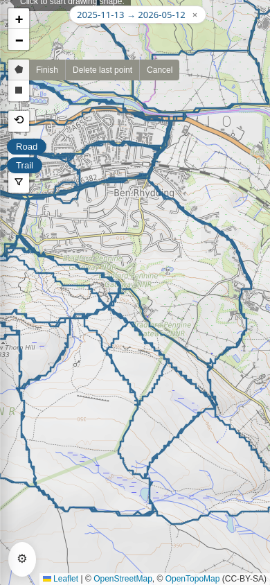

Arming the polygon control surfaces Leaflet.draw's default tooltip "Click the first point to close this shape" at the very top of the map. The Cancel/Finish actions are crammed onto a narrow strip below the toolbar (1). On desktop (D9) this was small but legible; at 390 px it overlaps the matches/filter-chip strip and becomes essentially unreadable. The polygon button gets no active highlight, so the only signal "you are drawing" is the tiny tooltip that occupies the same strip as the filter chip.

**Observation:** Polygon-arming chrome is sized for desktop and doesn't reflow at 390 px.

### M12. (Same as D19) Both pills off — silent empty map, no signal

Same behaviour as desktop. On mobile the problem is worse because the pills are buried under the Display button (M1), so a user who *finds* the pills and turns them both off has no way of knowing why the map went blank — and no inline message appears. The empty state shows the basemap with the filter chip still visible at top (1) but no track data.

**Observation:** Empty-state message that was missing on desktop is also missing on mobile, where the trigger is harder to find and harder to undo.

### M13. No mobile-specific bottom bar / sheet pattern — everything is desktop-shrunk

A general observation: nothing about this layout is mobile-native. There is no bottom navigation bar, no bottom sheet for matches/preview (the standard iOS Maps / Google Maps pattern), no drag handle, no swipe-to-dismiss on the preview or matches panel, no half/full sheet detents. Each surface is a desktop popover or modal scaled down. For a map app, where 99 % of the screen should be the map, the mobile experience reads as "desktop site that fits".

**Observation:** Mobile chrome is desktop chrome at 390 px — no platform-native sheet/bottom-bar pattern.

---

## Mobile coverage-checklist sweep

_To be filled in Task 4._

---

## Pass 2 — Surface inventory

_To be filled in Task 5._

---

## Pass 3 — Proposed fixes

_To be filled in Task 6._
